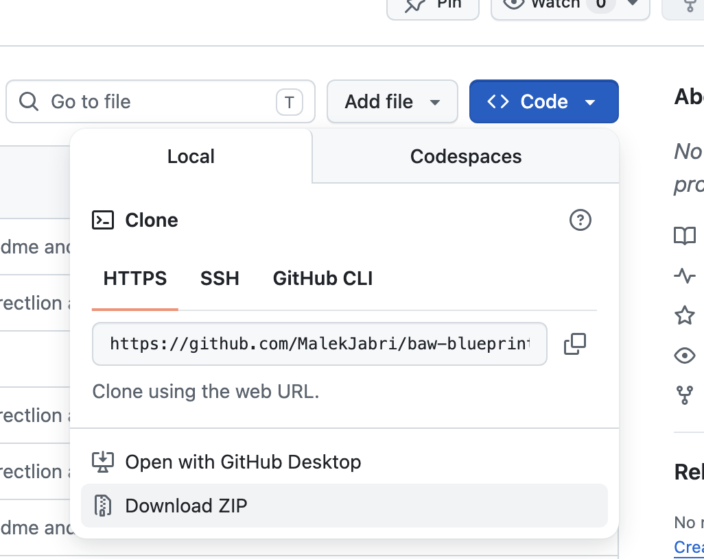

# Lab: Using BAW Blueprint Parser Mode to Generate BPMN and Business Objects

## Lab Overview

**Duration:** 30-45 minutes  
**Difficulty:** Intermediate  
**Prerequisites:** 
- Basic understanding of business processes
- Familiarity with BPMN concepts
- Access to Bob AI assistant with BAW Blueprint Parser mode

## 📋 Prerequisites

- [ ] **IBM BAW** (v24.x or v25.x) with IBM Business Automation Studio access
- [ ] **Python 3.7+** installed
- [ ] **Bob AI** configured with Blueprint Parser mode
- [ ] **Business documents** (PDF, Word, Excel, etc.)
- [ ] *Plugin installed for top**  
    - Simple OpenAPI Viewer
    - KIE Business Automation Bundle
    - Markdown Preview Mermaid Support 

## Lab Scenario

---

## 🚀 Step-by-Step Guide

### Step 1: Clone the Repository
```bash
git clone https://github.com/MalekJabri/baw-blueprint.git
cd BAW_BLUEPRINT
```
 or just click download zip 

 


## Learning Objectives

By the end of this lab, you will be able to:
1. Analyze business blueprint documents to extract data models and processes
2. Generate business object JSON definitions from data models
3. Create BPMN process configurations from process descriptions
4. Generate IBM BAW-compatible BPMN XML files
5. Create catalogs and OpenAPI specifications for documentation
6. Understand the BAW Blueprint Parser mode workflow

---

## Lab Scenario

You are a Business Automation Architect at a South African financial institution. You've received a comprehensive business blueprint document describing the **Cross-Border Payments** process, including:
- Data model with 8 core entities
- End-to-end process flow with 5 stages
- Regulatory compliance requirements (SARB, FICA, SARS)
- Multiple roles and decision points

Your task is to use Bob's BAW Blueprint Parser mode to automatically generate:
- Business object definitions
- BPMN process models
- Documentation and catalogs

---

## Lab Setup

### Step 1: Verify Project Structure

Ensure your workspace has the following structure:

```
BAW_BluePrint/
├── business-blueprints/          # Source documents
├── business-objects/
│   ├── generated/                # Generated business objects
│   └── catalog/                  # Business object catalogs
├── business-processes/
│   ├── configs/                  # BPMN configurations
│   ├── bpmn/                     # Generated BPMN files
│   └── catalog/                  # Process catalogs
├── BPMN_tools/                   # BPMN generation tools
└── docs/                         # Documentation
```

### Step 2: Locate the Blueprint Document

The sample blueprint is located at:
```
business-blueprints/Cross-Border_Payments_South_Africa.docx
```

This document contains:
- **Section 1:** Overview of participants and payment rails
- **Section 2:** Data Model with 8 core entities
- **Section 3:** Process Definition with 5 stages
- **Section 4:** Regulatory Framework
- **Section 5:** Implementation Best Practices

---

## Part 1: Activating BAW Blueprint Parser Mode

### Step 1.1: Switch to BAW Blueprint Parser Mode

**Prompt to Bob:**
```
Please switch to BAW Blueprint Parser mode
```

**Expected Response:**
Bob will confirm the mode switch and explain the mode's capabilities.

### Step 1.2: Understand Mode Capabilities

The BAW Blueprint Parser mode can:
- ✅ Read and analyze business documents (DOCX, PDF, MD)
- ✅ Extract data models and generate business objects
- ✅ Extract process flows and generate BPMN
- ✅ Create catalogs and documentation
- ✅ Generate OpenAPI specifications
- ✅ Validate and fix common issues

---

## Part 2: Analyzing the Blueprint Document

### Step 2.1: Request Document Analysis

**Prompt to Bob:**
```
Please review the Cross-Border Payments blueprint document and provide me the BPMN and business objects
```

**What Bob Will Do:**
1. Read the blueprint document
2. Identify the data model section
3. Identify the process definition section
4. Extract entities and their attributes
5. Extract process stages, activities, and decision points

### Step 2.2: Observe the Analysis Process

Bob will create a TODO list showing progress:
- [x] Analyze Cross-Border Payments blueprint document
- [-] Extract business objects from data model
- [ ] Generate business object JSON files
- [ ] Extract process workflow from blueprint
- [ ] Generate BPMN config JSON file
- [ ] Generate BPMN XML files
- [ ] Create catalogs

**💡 Tip:** Bob works step-by-step and waits for confirmation after each tool use.

---

## Part 3: Generating Business Objects

### Step 3.1: Business Object Generation

Bob will automatically generate 8 business object files in:
```
business-objects/generated/CrossBorderPayments/
```

**Generated Files:**
1. `Party.json` - Individuals/organizations (16 properties)
2. `Account.json` - Account details (13 properties)
3. `PaymentInstruction.json` - Core transaction (21 properties)
4. `FXConversion.json` - Exchange rate data (14 properties)
5. `RegulatoryClassification.json` - BoP/SARB data (15 properties)
6. `ComplianceRecord.json` - AML/FICA data (24 properties)
7. `SettlementLeg.json` - Settlement tracking (19 properties)
8. `StatusEvent.json` - Audit trail (14 properties)

### Step 3.2: Review a Business Object

**Open:** `business-objects/generated/CrossBorderPayments/Party.json`

**Key Elements to Note:**
```json
{
  "name": "Party",
  "namespace": "CrossBorderPayments",
  "description": "Represents any individual or organisation...",
  "type": "businessObject",
  "properties": {
    "partyId": {
      "type": "string",
      "required": true,
      "description": "Unique identifier for the party"
    },
    "partyType": {
      "type": "string",
      "required": true,
      "enum": ["Individual", "Organisation", "UBO", "Intermediary"]
    }
    // ... more properties
  }
}
```

**✅ Verification Checklist:**
- [ ] `type` is set to `"businessObject"`
- [ ] `properties` contains all expected fields
- [ ] Each property has `type`, `required`, and `description`
- [ ] Enumerations are defined where applicable
- [ ] Relationships to other objects are clear

---

## Part 4: Generating BPMN Process

### Step 4.1: BPMN Configuration Generation

Bob generates a BPMN configuration file:
```
business-processes/configs/CrossBorderPayments/
  CrossBorderPaymentProcess.bpmn-config.json
```

**Configuration Structure:**
```json
{
  "process": {
    "id": "proc-crossborder-001",
    "name": "Cross-Border Payment Process",
    "description": "End-to-end cross-border payment process..."
  },
  "roles": [
    { "id": "role-originator", "name": "Originator/Customer" },
    { "id": "role-ad", "name": "Authorised Dealer" }
    // ... more roles
  ],
  "milestones": [
    { "id": "ms-initiated", "name": "Payment Initiated" }
    // ... more milestones
  ],
  "elements": [
    {
      "id": "elem-start-1",
      "type": "startEvent",
      "name": "Payment Request Received"
    }
    // ... more elements
  ],
  "flows": [
    {
      "id": "flow-1",
      "sourceRef": "elem-start-1",
      "targetRef": "elem-task-1"
    }
    // ... more flows
  ],
  "lanes": [
    {
      "id": "lane-role-originator",
      "name": "Originator/Customer",
      "flowNodeRefs": ["elem-task-1", "elem-task-3"]
    }
    // ... more lanes
  ]
}
```

### Step 4.2: BPMN XML Generation

Bob automatically generates two BPMN files:

**1. IBM BAW Version:**
```
business-processes/bpmn/CrossBorderPayments/
  CrossBorderPaymentProcess.bpmn
```
- Contains IBM-specific extensions
- Ready for import into IBM Business Automation Studio 
- Includes milestones and BAW metadata

**2. Standard BPMN 2.0 Preview:**
```
business-processes/bpmn/CrossBorderPayments/
  CrossBorderPaymentProcess-preview.bpmn
```
- Pure BPMN 2.0 standard
- Compatible with any BPMN viewer (bpmn.io, online viewers)
- Includes diagram interchange (DI) for visual layout

### Step 4.3: Verify BPMN Generation

**Command Output:**
```
✅ Successfully generated BPMN files
   📦 IBM BAW version: CrossBorderPaymentProcess.bpmn
   📋 Standard BPMN 2.0 preview: CrossBorderPaymentProcess-preview.bpmn
```

---

## Part 5: Packaging BPMN Definition

### Step 5.1: Creating a BPMN Package

After generating the BPMN files, you can create a standalone ZIP package for review, testing, or deployment.

**What is BPMN Packaging?**
- Creates a ZIP file containing the BPMN definition and metadata
- Includes IBM BAW BPMN XML (excludes preview files)
- Includes original JSON configuration
- Includes README with metadata and usage instructions
- Ready for import into IBM Business Automation Studio 

### Step 5.2: Run the Package Script

**Command:**
```bash
python3 BPMN_tools/package_bpmn_definition.py \
  business-processes/configs/CrossBorderPayments/CrossBorderPaymentProcess.bpmn-config.json
```

**Expected Output:**
```
📦 Packaging BPMN definition from: business-processes/configs/CrossBorderPayments/CrossBorderPaymentProcess.bpmn-config.json
✅ Configuration validated successfully
🔨 Generating BPMN XML...
✅ BPMN XML generated: CrossBorderPaymentProcess.bpmn
📦 Creating ZIP package: business-processes/packages/CrossBorderPayments/CrossBorderPaymentProcess.zip

✅ Successfully created BPMN definition package!
   📦 Package: business-processes/packages/CrossBorderPayments/CrossBorderPaymentProcess.zip
   📄 Contains:
      - CrossBorderPaymentProcess.bpmn (IBM BAW BPMN)
      - CrossBorderPaymentProcess.bpmn-config.json (JSON config)
      - README.md (metadata & instructions)

   Process: Cross-Border Payment Process
   Version: 1.0
   Context: CrossBorderPayments
```

### Step 5.3: Verify Package Contents

**Package Location:**
```
business-processes/packages/CrossBorderPayments/CrossBorderPaymentProcess.zip
```

**Package Structure:**
```
CrossBorderPaymentProcess.zip
├── CrossBorderPaymentProcess.bpmn          (IBM BAW BPMN XML)
├── CrossBorderPaymentProcess.bpmn-config.json  (JSON configuration)
└── README.md                                (metadata & instructions)
```

### Step 5.4: Review Package README

The generated README includes:
- **Process Information** - ID, version, business context
- **Description** - Process overview
- **Package Contents** - File descriptions
- **Usage Instructions** - How to import into IBM BAW
- **Regeneration Instructions** - How to regenerate from config
- **Source Information** - Original document reference

### Step 5.5: Use Cases for BPMN Packages

**1. Review and Validation**
- Share with business stakeholders
- Review process logic before implementation
- Validate against requirements

**2. Testing in IBM BAW**
- Import into IBM Business Automation Studio  test environment
- Test process execution
- Validate integrations

**3. Standalone Deployment**
- Deploy to IBM BAW environments
- Import into existing Process Applications
- Version control and archival

**4. Documentation**
- Archive process definitions
- Share with external teams
- Compliance and audit purposes

### Step 5.6: Important Notes

**✅ What's Included:**
- IBM BAW BPMN XML with extensions
- Original JSON configuration
- Complete metadata and instructions

**❌ What's NOT Included:**
- Preview BPMN files (for generic viewers)
- Business object definitions
- Service implementations
- Coach views or UI components

**💡 For Complete Packaging:**
For a full TWX toolkit with business objects, services, and UI components, use the **BAW Package Manager mode** instead.

---

## Part 6: Understanding the Generated Process

### Step 5.1: Process Overview

The generated process includes:

**5 Roles (Swimlanes):**
1. Originator/Customer
2. Payment System (automated)
3. Compliance Officer
4. Authorised Dealer
5. Correspondent Bank

**5 Milestones:**
1. Payment Initiated
2. Compliance Screening Complete
3. Payment Authorized
4. Payment Transmitted
5. Payment Settled

**16 Activities:**
- 3 User Tasks (manual activities)
- 13 Service Tasks (automated activities)
- 4 Gateways (decision points)
- 2 Events (start/end)

### Step 5.2: Process Flow Stages

**Stage 1: Initiation and Capture**
```
Start → Capture Payment Details → Validate Payment Data
```

**Stage 2: Compliance Screening**
```
FICA Verification → Sanctions Screening → [Gateway: Match?]
  ├─ No Match → Check SARS Tax Status
  └─ Potential Match → Manual Compliance Review → [Gateway: Approved?]
      ├─ Approved → Check SARS Tax Status
      └─ Rejected → End (Rejected)
```

**Stage 3: Authorization and FX**
```
[Gateway: SARB Approval Required?]
  ├─ No → Calculate FX Rate
  └─ Yes → Obtain SARB Approval → Calculate FX Rate
→ Authorize Payment
```

**Stage 4: Routing and Settlement**
```
Format Payment Message → Transmit to Correspondent
→ Post Settlement Entries → Confirm Beneficiary Credit
```

**Stage 5: Reporting and Reconciliation**
```
Report to SARB → Reconcile Settlement → End (Complete)
```

---

## Part 6: Viewing the BPMN Diagram

### Step 6.1: Open in BPMN Viewer

**Option A: Using bpmn.io (Online)**
1. Go to https://demo.bpmn.io/
2. Click "Open File"
3. Select `CrossBorderPaymentProcess-preview.bpmn`
4. View the process diagram

**Option B: Using IBM Business Automation Studio **
1. Open IBM Business Automation Workflow IBM Business Automation Studio 
2. Import → Select `CrossBorderPaymentProcess.bpmn`
3. View with IBM-specific features (milestones, etc.)

### Step 6.2: Verify Layout Quality

**Check for:**
- ✅ All lanes have consistent width
- ✅ Activities are properly spaced horizontally
- ✅ No overlapping elements
- ✅ Clear flow from left to right
- ✅ Gateways properly positioned
- ✅ Sequence flows connect correctly

**💡 Note:** The enhanced layout algorithm automatically calculates lane width based on process complexity, ensuring consistent appearance.

---

## Part 7: Exploring Generated Catalogs

### Step 7.1: Business Object Catalog

**Open:** `business-objects/catalog/CrossBorderPayments.catalog.json`

**Contents:**
```json
{
  "context": "CrossBorderPayments",
  "version": "1.0.0",
  "businessObjects": [
    {
      "name": "Party",
      "path": "business-objects/generated/CrossBorderPayments/Party.json",
      "description": "Represents any individual or organisation...",
      "type": "complex"
    }
    // ... 7 more objects
  ],
  "relationships": [
    {
      "from": "PaymentInstruction",
      "to": "Party",
      "type": "references",
      "description": "PaymentInstruction references originator and beneficiary"
    }
    // ... more relationships
  ]
}
```

**Use Cases:**
- Documentation generation
- Dependency analysis
- Impact assessment
- Team onboarding

### Step 7.2: Process Catalog

**Open:** `business-processes/catalog/CrossBorderPayments.process-catalog.json`

**Contents:**
```json
{
  "context": "CrossBorderPayments",
  "processes": [
    {
      "processId": "proc-crossborder-001",
      "processName": "Cross-Border Payment Process",
      "actors": ["Originator/Customer", "Authorised Dealer", ...],
      "businessObjects": ["Party", "Account", ...],
      "milestones": ["Payment Initiated", ...],
      "complexity": "high",
      "estimatedDuration": "1-3 business days",
      "regulatoryFramework": [
        "Exchange Control Regulations (1961)",
        "FICA",
        "SARS Tax Compliance Requirements"
      ]
    }
  ]
}
```

### Step 7.3: OpenAPI Specification

**Open:** `business-objects/openapi-spec.json`

**Purpose:**
- Machine-readable schema catalog
- API documentation generation
- Code generation for client applications
- Integration with API management tools

**Sample Schema:**
```json
{
  "openapi": "3.0.3",
  "info": {
    "title": "CrossBorderPayments Business Objects",
    "version": "1.0.0"
  },
  "components": {
    "schemas": {
      "Party": {
        "type": "object",
        "required": ["partyId", "partyType", "fullName"],
        "properties": {
          "partyId": { "type": "string" },
          "partyType": { 
            "type": "string",
            "enum": ["Individual", "Organisation", "UBO", "Intermediary"]
          }
        }
      }
    }
  }
}
```

---

## Part 9: Importing to IBM BAW - Accelerating Your BAW Journey

### Step 9.1: Overview - From Blueprint to Production

**What You've Generated:**
- ✅ 8 Business Objects (JSON definitions)
- ✅ 1 BPMN Process (IBM BAW XML + Standard preview)
- ✅ 1 BPMN Package (ZIP with config and README)
- ✅ OpenAPI Specification (API documentation)
- ✅ Catalogs (Business objects and processes)

**Time Saved:** What traditionally takes 2-3 days of manual modeling is now complete in minutes!

### Step 9.2: Import BPMN Package to IBM Business Automation Studio 

**Step-by-Step Import:**

1. **Extract the BPMN Package**
   ```
   Unzip: business-processes/packages/CrossBorderPayments/CrossBorderPaymentProcess.zip
   ```

2. **Open IBM Business Automation Studio **
   - Launch IBM Business Automation Workflow IBM Business Automation Studio 
   - Navigate to your Process Application or Toolkit

3. **Import the BPMN Definition**
   - Right-click on "Business Processes" folder
   - Select "Import" → "BPMN 2.0"
   - Browse to `CrossBorderPaymentProcess.bpmn`
   - Click "Import"

4. **Review Import Results**
   - IBM Business Automation Studio  will show the imported process
   - All 5 swimlanes (roles) are preserved
   - All 16 activities are imported
   - All 4 gateways and decision points are configured
   - Sequence flows are connected correctly

**✅ What's Automatically Configured:**
- Process structure and flow
- Swimlanes and role assignments
- Gateway logic and conditions
- Activity names and types
- Milestones (IBM BAW extension)

### Step 9.3: Import Business Objects

**Using the OpenAPI Specification:**

1. **Open the OpenAPI Spec**
   ```
   File: business-objects/openapi-spec.json
   ```

2. **Import to IBM BAW**
   - In IBM Business Automation Studio , navigate to "Business Objects"
   - Use "Import from OpenAPI" or manually create based on spec
   - Import all 8 business objects:
     - Party
     - Account
     - PaymentInstruction
     - FXConversion
     - RegulatoryClassification
     - ComplianceRecord
     - SettlementLeg
     - StatusEvent

3. **Verify Business Object Structure**
   - Each object has all properties defined
   - Data types are correctly mapped
   - Required fields are marked
   - Enumerations are configured

**💡 Pro Tip:** The OpenAPI spec provides the exact schema needed for BAW Business Objects, eliminating manual data modeling.

### Step 9.4: Configure Process Variables

**Map Business Objects to Process:**

1. **Add Process Variables**
   - Open the imported process
   - Add variables for each business object:
     ```
     - paymentInstruction (PaymentInstruction)
     - originator (Party)
     - beneficiary (Party)
     - fxConversion (FXConversion)
     - complianceRecord (ComplianceRecord)
     ```

2. **Configure Activity Inputs/Outputs**
   - For each User Task, configure:
     - Input variables (data needed)
     - Output variables (data produced)
   - For each Service Task, configure:
     - Service implementation
     - Input/output mapping

### Step 9.5: Implement Services and Integrations

**Next Steps for Production:**

1. **Service Tasks** - Implement automated activities:
   - FICA Verification → Connect to FICA service
   - Sanctions Screening → Connect to sanctions database
   - Calculate FX Rate → Connect to FX service
   - Format Payment Message → Implement SWIFT/ISO20022 formatting

2. **User Tasks** - Create Coach Views:
   - Capture Payment Details → Payment entry form
   - Manual Compliance Review → Compliance review screen
   - Obtain SARB Approval → Approval form

3. **Integrations** - Connect external systems:
   - SARB reporting API
   - SARS tax verification
   - Correspondent bank messaging
   - Settlement system

### Step 9.6: Test the Process

**Testing Workflow:**

1. **Create Test Instance**
   - Use IBM Business Automation Studio 's test mode
   - Create sample payment instruction
   - Populate test data for all business objects

2. **Execute Process**
   - Start the process
   - Step through each activity
   - Verify gateway decisions
   - Check data flow between activities

3. **Validate Results**
   - Confirm all paths work correctly
   - Verify compliance checks
   - Test error handling
   - Validate reporting

### Step 9.7: Time Savings Summary

**Traditional Approach vs. Bob-Accelerated:**

| Activity | Traditional Time | With Bob | Time Saved |
|----------|-----------------|----------|------------|
| Analyze blueprint document | 4-6 hours | 5 minutes | 95% |
| Model business objects | 8-12 hours | 5 minutes | 98% |
| Create BPMN process | 12-16 hours | 10 minutes | 97% |
| Document artifacts | 4-6 hours | Auto-generated | 100% |
| Create catalogs | 2-4 hours | Auto-generated | 100% |
| **Total** | **30-44 hours** | **20 minutes** | **~98%** |

**What Bob Provides:**
- ✅ Instant business object definitions
- ✅ Complete BPMN process structure
- ✅ IBM BAW-ready artifacts
- ✅ Comprehensive documentation
- ✅ OpenAPI specifications
- ✅ Validation and quality checks

**What You Still Need to Do:**
- ⚙️ Implement service integrations
- 🎨 Design user interfaces (Coach Views)
- 🔧 Configure business rules
- 🧪 Test and validate
- 🚀 Deploy to production

**Result:** Focus on business logic and integrations, not manual modeling!

---

## Part 10: Understanding the Template System

### Step 10.1: Business Object Template

**Open:** `docs/BUSINESS_OBJECT_TEMPLATE.md`

**Key Sections:**
1. **Critical Format Requirements**
   - Type field must be `"businessObject"`
   - Properties must be an array (not object)
   - Type names use PascalCase

2. **Complete Template**
   - Ready-to-use template with all property types
   - Examples for each data type
   - Validation checklist

3. **Common Mistakes**
   - What to avoid
   - How to fix issues

**💡 Use Case:** Reference this template when creating new business objects manually or when Bob generates them.

---

## Part 11: Hands-On Exercise (Optional)

### Exercise 1: Modify a Business Object

**Task:** Add a new property to the `Party` business object

**Steps:**
1. Open `business-objects/generated/CrossBorderPayments/Party.json`
2. Add a new property:
   ```json
   "taxIdentificationNumber": {
     "type": "string",
     "required": false,
     "description": "Tax identification number for the party"
   }
   ```
3. Save the file
4. Verify the JSON is valid

**Expected Result:** Business object now includes tax ID field

### Exercise 2: Regenerate BPMN with Changes

**Task:** Regenerate BPMN files after modifying the config

**Steps:**
1. Open `business-processes/configs/CrossBorderPayments/CrossBorderPaymentProcess.bpmn-config.json`
2. Modify a task name (e.g., change "Capture Payment Details" to "Capture Payment Information")
3. Run the generator:
   ```bash
   python3 BPMN_tools/generate_bpmn.py \
     business-processes/configs/CrossBorderPayments/CrossBorderPaymentProcess.bpmn-config.json \
     business-processes/bpmn/CrossBorderPayments/CrossBorderPaymentProcess.bpmn
   ```
4. Open the regenerated BPMN file in a viewer
5. Verify the change appears in the diagram

**Expected Result:** BPMN diagram reflects the updated task name

### Exercise 3: Create a Simple Process

**Task:** Ask Bob to create a simple approval process

**Prompt to Bob:**
```
Create a simple document approval process with:
- Start event
- Submit Document (user task)
- Review Document (user task)
- Approve/Reject gateway
- Approved end event
- Rejected end event

Generate the BPMN config and XML files.
```

**Expected Result:** Bob generates a new simple process with the specified elements

---

## Part 12: Best Practices and Tips

### Best Practice 1: Document Structure

**For Best Results:**
- ✅ Clear section headings (Data Model, Process Definition)
- ✅ Structured entity descriptions with attributes
- ✅ Step-by-step process flows
- ✅ Role definitions
- ✅ Decision points clearly marked

**Example Good Structure:**
```
# Data Model
## Entity: Customer
- customerId (string, required): Unique identifier
- name (string, required): Customer full name
- email (string, optional): Email address

# Process Definition
## Stage 1: Initiation
1. Customer submits request
2. System validates data
3. If valid, proceed to Stage 2
4. If invalid, return to customer
```

### Best Practice 2: Iterative Refinement

**Workflow:**
1. Generate initial artifacts
2. Review in BPMN viewer
3. Identify improvements
4. Modify config files
5. Regenerate
6. Repeat until satisfied

### Best Practice 3: Version Control

**Recommended:**
- Commit generated files to Git
- Tag releases (v1.0.0, v1.1.0)
- Document changes in commit messages
- Keep source documents in version control

### Best Practice 4: Validation

**Always Verify:**
- [ ] Business objects have correct type field
- [ ] Properties format matches template
- [ ] BPMN files open without errors
- [ ] All relationships are captured
- [ ] Regulatory requirements are included

---

## Part 13: Troubleshooting

### Issue 1: Business Objects Not Recognized

**Symptom:**
```
⚠️ Skipping Party.json: not a businessObject type
```

**Cause:** Type field is not set to `"businessObject"`

**Solution:**
1. Open the business object JSON file
2. Change `"type": "complex"` to `"type": "businessObject"`
3. Save and retry

### Issue 2: Properties Format Error

**Symptom:**
```
AttributeError: 'str' object has no attribute 'get'
```

**Cause:** Properties are formatted as object instead of array

**Solution:**
Refer to `docs/BUSINESS_OBJECT_TEMPLATE.md` for correct format:
```json
"properties": [
  {
    "name": "propertyName",
    "type": "String",
    "required": true
  }
]
```

### Issue 3: BPMN Gateway Direction Error

**Symptom:**
```
Unknown gateway direction: null
```

**Cause:** Gateway missing `gatewayDirection` attribute

**Solution:** This is automatically fixed in the latest version. Regenerate BPMN files.

### Issue 4: Lane Width Inconsistency

**Symptom:** Lanes have different widths in BPMN viewer

**Cause:** Using old version without dynamic layout

**Solution:** 
1. Ensure you have the latest `BPMN_tools/bpmn_xml_builder.py`
2. Regenerate BPMN files
3. The enhanced layout algorithm will calculate consistent widths

---

## Part 13: Advanced Topics

### Advanced Topic 1: Custom BPMN Elements

**Adding Custom Properties:**
```json
{
  "id": "elem-task-1",
  "type": "userTask",
  "name": "Review Application",
  "properties": {
    "description": "Detailed task description",
    "implementation": "ServiceName",
    "form": "ReviewForm",
    "priority": "high",
    "sla": "2 hours"
  }
}
```

### Advanced Topic 2: Complex Gateway Logic

**Multiple Conditions:**
```json
{
  "id": "gateway-1",
  "type": "exclusiveGateway",
  "name": "Risk Assessment",
  "outgoing": ["flow-high", "flow-medium", "flow-low"]
},
{
  "id": "flow-high",
  "sourceRef": "gateway-1",
  "targetRef": "task-manual-review",
  "name": "High Risk",
  "condition": "${riskScore > 80}"
},
{
  "id": "flow-medium",
  "sourceRef": "gateway-1",
  "targetRef": "task-automated-check",
  "name": "Medium Risk",
  "condition": "${riskScore >= 40 && riskScore <= 80}"
}
```

### Advanced Topic 3: Subprocess Integration

**Calling Subprocesses:**
```json
{
  "id": "elem-subprocess-1",
  "type": "callActivity",
  "name": "KYC Verification",
  "properties": {
    "calledElement": "proc-kyc-001",
    "inheritVariables": true
  }
}
```

---

## Part 15: Advanced Packaging with BAW Package Manager

### Step 15.1: Full Toolkit Packaging

For complete TWX toolkit packaging (beyond standalone BPMN):

**Using BAW Package Manager Mode:**
```
Ask Bob: "Switch to BAW Package Manager mode and create a toolkit package"
```

Bob will:
- Generate .twx file
- Include business objects
- Include process definitions
- Package dependencies
- Include Coach Views and UI components

### Step 15.2: Extend the Solution

**Ideas for Extension:**
- Add error handling subprocesses
- Create dashboard views
- Implement SLA monitoring
- Add notification services
- Create reporting processes

---

## Lab Summary

### What You Learned

✅ **Document Analysis**
- How to structure business blueprints
- What information Bob needs to extract

✅ **Business Object Generation**
- Correct JSON format for business objects
- Property definitions and relationships
- Catalog creation

✅ **BPMN Generation**
- Config-driven BPMN creation
- IBM BAW vs. Standard BPMN 2.0
- Layout optimization

✅ **Best Practices**
- Template usage
- Validation techniques
- Troubleshooting common issues

### Generated Artifacts

📦 **8 Business Objects**
- Complete data model for cross-border payments
- Ready for BAW import

📊 **1 BPMN Process** (2 formats)
- IBM BAW version with extensions
- Standard BPMN 2.0 for universal compatibility

📚 **5 Catalogs**
- Business object catalog
- Process catalog
- Master catalogs
- OpenAPI specification

📖 **2 Templates**
- Business object template
- BPMN layout enhancement guide

### Key Takeaways

1. **Automation:** Bob automates 90% of the manual work in creating BAW artifacts
2. **Consistency:** Generated artifacts follow IBM BAW conventions
3. **Quality:** Built-in validation and best practices
4. **Flexibility:** Easy to customize and extend
5. **Documentation:** Comprehensive catalogs and specifications

---

## Additional Resources

### Documentation
- [`docs/BAW_BLUEPRINT_PARSER_MODE.md`](BAW_BLUEPRINT_PARSER_MODE.md) - Mode reference
- [`docs/BUSINESS_OBJECT_TEMPLATE.md`](BUSINESS_OBJECT_TEMPLATE.md) - BO template
- [`BPMN_tools/USER_GUIDE.md`](../BPMN_tools/USER_GUIDE.md) - BPMN tools guide
- [`BPMN_tools/LAYOUT_ENHANCEMENT.md`](../BPMN_tools/LAYOUT_ENHANCEMENT.md) - Layout guide

### Tools
- [bpmn.io](https://demo.bpmn.io/) - Online BPMN viewer
- IBM Business Automation Studio - Enterprise BPMN tool

### Sample Files
- [`business-blueprints/Cross-Border_Payments_South_Africa.docx`](../business-blueprints/Cross-Border_Payments_South_Africa.docx)
- All generated artifacts in `business-objects/` and `business-processes/`

---

## Lab Completion Checklist

- [ ] Activated BAW Blueprint Parser mode
- [ ] Analyzed the Cross-Border Payments blueprint
- [ ] Generated 8 business objects
- [ ] Generated BPMN config and XML files
- [ ] Viewed BPMN diagram in a viewer
- [ ] Explored generated catalogs
- [ ] Reviewed templates and documentation
- [ ] Completed at least one hands-on exercise
- [ ] Understood troubleshooting techniques
- [ ] Identified next steps for your project

---

**Congratulations!** You've completed the BAW Blueprint Parser lab. You now know how to leverage Bob's AI capabilities to accelerate IBM BAW development.

**Lab Version:** 1.0.0  
**Last Updated:** 2026-06-18  
**Feedback:** Share your experience and suggestions for improvement